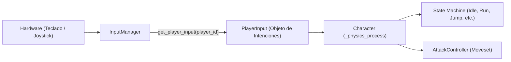

# Explicación de `core/player_input.gd` (Formato de Intenciones)

## Resumen
`PlayerInput` es una estructura de datos abstracta y desacoplada que representa las intenciones de control de un jugador en un frame específico de física.

Aísla completamente la lógica física del personaje (`CharacterBody3D`), los componentes y la máquina de estados (`StateMachine`) del hardware físico (teclado, joystick o eventos de red/IA).

---

## 📋 Estructura de Campos

```gdscript
class_name PlayerInput
extends RefCounted

var movement: Vector2 = Vector2.ZERO  # X: [-1.0..1.0] (Izq/Der), Y: [-1.0..1.0] (Abajo/Arriba)
var is_dash: bool = false             # Intención de carrera rápida (Double Tap)
var jump_pressed: bool = false        # Salto presionado este frame (Just Pressed)
var jump_held: bool = false           # Salto sostenido (Short Hop vs Full Hop)
var attack_pressed: bool = false      # Ataque normal presionado este frame
var special_pressed: bool = false     # Ataque especial presionado este frame
var shield_pressed: bool = false      # Escudo presionado/sostenido
```

---

## 🔄 Flujo y Adapter



1. **`InputManager`** actúa como adapter reuniendo el estado de las acciones de `InputMap` y generando una instancia de `PlayerInput`.
2. **`Character`** lee la instancia en `_physics_process(delta)` asignando `current_input = InputManager.get_player_input(player_id)`.
3. **`StateMachine` y Componentes** consultan el estado mediante `character.current_input` o helpers de intención (`character.is_dash_intent()`, `character.is_jump_held()`, `character.get_input_vector()`).

---

## Beneficios Arquitectónicos
* **Soporte Plug-and-Play de Dispositivos**: Cambiar de teclado a mando o remapear controles no requiere tocar una sola línea de código de físicas ni de la FSM.
* **Fácil Integración de Bots / IA**: Un bot solo necesita generar un objeto `PlayerInput` y asignarlo a `character.current_input`.
* **Determinismo y Replay**: Permite grabar y reproducir partidas serializando únicamente la lista de `PlayerInput` frame a frame.
